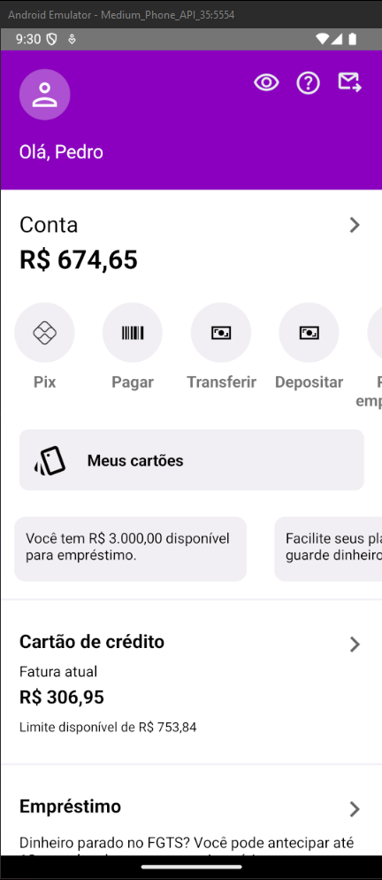
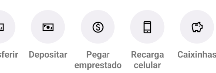

# Home Nubank React-Native
### Proposta do desenvolvimento
Para aprimorar minhas habilidades em React-Native, decidi desenvolver a tela inicial do aplicativo do banco Nubank, buscando reproduzir a interface o mais fielmente possível em relação ao aplicativo original.

### Tecnologia utilizada
- React-Native-cli

### Site onde peguei as logos
Google fonts: https://fonts.google.com/icons?icon.size=24&icon.color=%23000000

### Paleta de cores:
- Roxo: #8A05BE
- Fundo: #FFF
- Fundo ícones: #f1eff4

### Cards
Desenvolvi dois carrosséis horizontais:
- 1°: Opções financeiras do Nubank
- 2°: Cads de informações

  

#### Minhas redes sociais
Linkedin: https://www.linkedin.com/in/pedro-oliveira-b820811b4/  
GitHub: https://github.com/PedroPro212  
Instagram: @pedropro212